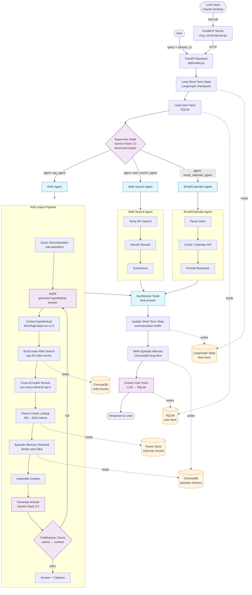
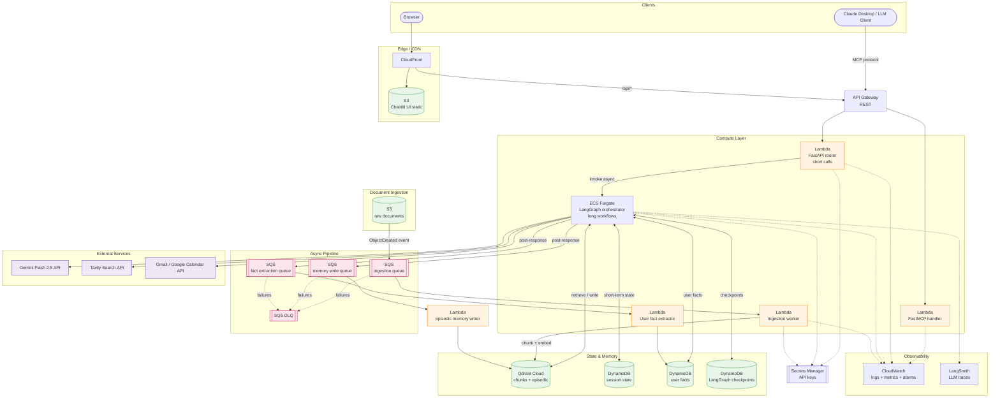

## Application Workflow

End-to-end query lifecycle inside the multi-agent system. Shows routing, per-agent flow (including the full RAG pipeline), and inline memory reads/writes.

---

## Production Architecture — AWS Serverless

Query-time and ingestion-time paths. Lambda for short calls, ECS Fargate for long LangGraph workflows, SQS for async fan-out, Qdrant Cloud external to AWS.

---

## Notes

- **Why Lambda + Fargate split:** Lambda caps at 15 min and has cold-start latency painful for short requests; LangGraph multi-agent workflows with iterative retrieval can exceed that. Fargate runs the long-lived orchestrator; Lambda fronts it for short synchronous paths (tool discovery, health, cached reads).
- **Why SQS between orchestrator and memory writers:** episodic memory + fact extraction shouldn't block the user-facing response. Fire-and-forget post-response.
- **Why DynamoDB over RDS:** session state and user facts are key-lookup workloads (by session_id, user_id). DynamoDB is serverless, sub-ms, no connection pooling pain from Lambda.
- **Qdrant Cloud (not self-hosted):** avoids running stateful vector DB infra in AWS. Trade-off: cross-cloud latency, external dependency.
